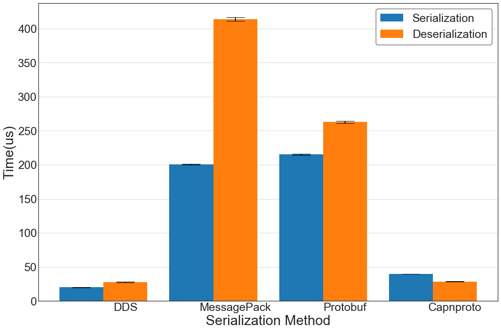

# Benchmarks of Serialization Methods

The purpose of this test is to evaluating (de)serialization efficiency of several common-used (de)serialization solutions, including CDR, MessagePack, Protobuf, and CapnProto. The testbed for this experiment is a Raspberry Pi cluster, and we (de)serialized the message 1000 times for each solution to gather the average (de)serialization time. The message objects represented by each data model are shown below. The initial C++ structure size is 14KB but due to different alignment and packet overhead of each method, the real packet size varies in each test. Note that the serialization time we measured does not include the time of allocating memory.
```c
const long SIZE_TEST_STR = 16;
const long SIZE_TEST_SEQ = 128;
const long SIZE_TEST_ARRAY_SEQ = 4;
const long SIZE_TEST_SEQ_ARRAY_SEQ = 4;
const long SIZE_OCTET_ARRAY = 360;

struct LongSeqTest {
  sequence<long, SIZE_TEST_SEQ> test_long_seq;
};//@Extensibility FINAL_EXTENSIBILITY
struct DoubleSeqTest {
  sequence<double, SIZE_TEST_SEQ> test_double_seq;
};//@Extensibility FINAL_EXTENSIBILITY
struct StringTest {
  char test_string[SIZE_TEST_STR];
};//@Extensibility FINAL_EXTENSIBILITY
struct StringSeqTest {
  sequence<StringTest, SIZE_TEST_SEQ> test_string_seq;
};//@Extensibility FINAL_EXTENSIBILITY
struct ArrayLongSeqTest {
  LongSeqTest test_array_long_seq[SIZE_TEST_ARRAY_SEQ];
};//@Extensibility FINAL_EXTENSIBILITY
struct SeqArrayLongSeqTest {
  sequence<ArrayLongSeqTest SIZE_TEST_SEQ_ARRAY_SEQ> seq_array_long_seq_test;
};//@Extensibility FINAL_EXTENSIBILITY
struct TestCustomType {
  long test_long;
  octet test_octet[SIZE_OCTET_ARRAY];
  LongSeqTest test_long_seq;
  StringTest test_string;
  StringSeqTest test_string_seq;
  DoubleSeqTest test_double_seq;
  ArrayLongSeqTest test_array_long_seq;
  SeqArrayLongSeqTest seq_array_long_seq_test;
};//@Extensibility FINAL_EXTENSIBILITY
```
## Experiment Results

